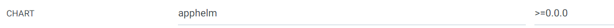
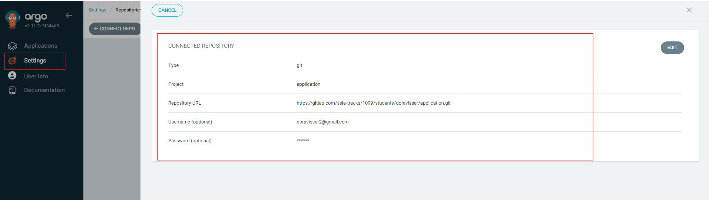
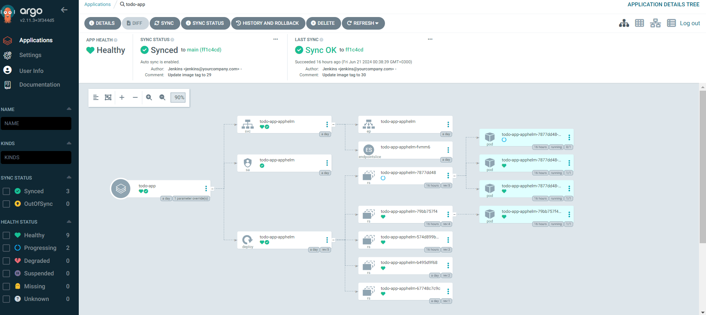

# K8s Application Deployment Pipeline
## Overview
This readme file outlines an end-to-end CI/CD pipeline that automates the deployment of a Flask application connected to MongoDB, running in a Kubernetes environment. The pipeline integrates Jenkins for continuous integration, Docker for containerization, Helm for package management and Argo CD for continuous deployment. 

Technologies Used: 
- Kubernetes: Container orchestration platform.
- Docker: Containerization technology.
- Flask: Python web framework.
- MongoDB: NoSQL database.
- Jenkins: Automation server for continuous integration.
- Helm: Package manager for Kubernetes.
- Argo CD: Declarative GitOps continuous delivery tool.

Before starting this readme , make sure you have a A functional application and you have read the previous readme of how to check your app locally!!

The structure and essential files: (before adding pytest)
```
/application/
├── .git/                # Git configuration and source directory.
├── app/                 # application files.
│   ├── static/          # CSS, JavaScript, and image files for the web application.
│   └── templates/       # HTML templates for the web application.
├── apphelm/             # Helm chart for Kubernetes deployments.
│   ├── charts/          # Additional Helm charts on which this chart depends.
│   ├── templates/       # Template files that will generate Kubernetes manifest
│   ├── Chart.yaml       # A YAML file containing information about the chart.
│   └── values.yaml      # The default configuration values for the chart.
|── tests/               # the test app folder (The explanation is in a separate file inside the test folder)
│   ├── test_app.py/     # the test app code
├── .gitignore           # Specifies intentionally untracked files to ignore.
├── Dockerfile           # Dockerfile for building the Docker image.
├── jenkins-agent.yaml   # Jenkins agent configuration in Kubernetes format.
├── Jenkinsfile          # Defines the Jenkins pipeline for CI/CD processes.
├── README.md            # Markdown file providing an overview and documentation of the project.
├── mongosecrets.yaml    # the credentials of the mongo db Encrypted in base 64 (do not push them to git)
└── requirements.txt     # Python packages required for the application.
``` 

### Create a Jenkins Agent (jenkins-agent.yaml)

- This Kubernetes pod definition creates a pod named jenkins-agent-pod that runs a single container named ez-docker-helm-build. The container uses an image from a Docker registry (ezezeasy/ez-docker-helm-build:1.41), and the image pull policy is set to Always, meaning Kubernetes will check for a newer version of the image each time the pod starts.

- The container runs in a privileged security context, which is necessary for certain operations like accessing the host's Docker daemon. This is facilitated by mounting the Docker socket from the host (/var/run/docker.sock) into the container. This allows the container to interact with the host's Docker daemon, enabling it to build, run, and push Docker images directly from within the Kubernetes cluster.

### Create a Helm Chart for the Application (using gitbash)
- Initialize Helm Chart: Use helm create to generate a new chart template for your application, which will include Kubernetes deployment, service, and ingress resources. (in our exemple the name of the chart is "apphelm")
make sure you in the correct folder before doing this command:
```
$ helm create apphelm
```
- Customize Values: Edit the values.yaml file to define application-specific configurations like the image repository, tag, and other environment-specific settings. (you can see the adjusted files in the repository)

- make sure you adjust the depolyment.yaml, so that it is suitable for receiving secrets that you have put in the kubernetes ! 

### Create a Helm package (using gitbash)
- To create a Helm package called apphelm and upload it to Docker Hub as an OCI artifact, follow these steps:
```
$ cd /your root folder (this case is application)
$ helm package apphelm 
$ docker login --username <username> --password <password>
$ helm push apphelm-0.1.0.tgz oci://registry-1.docker.io/doravissar

```
You can verify that the Helm chart has been pushed successfully by checking your Docker Hub repository.

### Step 3: Configuring ArgoCD to Use the OCI Helm Chart (Using the ArgoCD Web UI)
1. Add the Docker Hub Repository
    - Go to Settings -> Repositories -> Connect Repo.
    - Choose Helm as the repository type.
    - Name : the name of the repository
    - Project : defult
    - Repository URL: oci://docker.io/your-dockerhub-username 
    - Enable OCI at the bottom of the page
    - User name and password - leave empty
    - Fill in your Docker Hub credentials.
    


2. Create the Application
    - Go to Applications and click New App
    - Application Name: myapp (whatever you want)
    - Project: default
    - sync policy Automatic (check the PRUNE RESOURCES and SELF HEAL)
    - SOURCE: 
        - Repository URL: registry-1.docker.io/doravissar
        - Chart - check the chart name in the chart.yaml
        - Version -  check the Version in the chart.yaml
    - DESTINATION:
        - Cluster URL - check the correct one
        - Namespace - the name space you want to deploy the app 

press create!! 

Importent note - if you want the argocd to look for the latest version, in the version fill - >=0.0.0 ! 



### Step 4: Configuring MongoDB Credentials Using Kubernetes Secrets
To ensure secure handling of MongoDB credentials, they should never be directly placed in the application code or any other files that might be part of your version control (GIT). Instead, store them safely in the Kubernetes cluster using Kubernetes Secrets. Here's how to accomplish this:

- create an mongo_secret.yaml: 
    This file defines a Kubernetes Secret object to securely store your MongoDB credentials. Each piece of data is encoded in base64 to meet the Kubernetes Secrets format requirement. Here's the YAML definition: (dont forget to put the name of the file in the git.ignore)
    ```
    apiVersion: v1
    kind: Secret
    metadata:
    name: mongodb-secret
    type: Opaque
    data:
    username: cm9vdA==
    password: bW9uZ29EQg==
    dbname: bXltb25nb2Ri
    ``` 
- Base64 Encoding:
To encode your credentials into base64, which is necessary for Kubernetes Secrets, use the following PowerShell commands on windows:
    ```
    [Convert]::ToBase64String([Text.Encoding]::UTF8.GetBytes("<username>"))
    [Convert]::ToBase64String([Text.Encoding]::UTF8.GetBytes("<password>"))
    [Convert]::ToBase64String([Text.Encoding]::UTF8.GetBytes("<db name>"))
    ```
    Replace <username>, <password>, and <db name> with your actual MongoDB credentials.

- Apply the Secret to Your Kubernetes Cluster:
    Once you've prepared your mongo_secret.yaml, deploy it to your Kubernetes cluster using the following command:
    ```
    kubectl apply -f .\mongosecrets.yaml -n app-helm-dev
    ```
    This command uploads the secret to the specified namespace app-helm-dev in your Kubernetes cluster. When ArgoCD deploys your application, the deployment configuration will reference these secrets, ensuring that your MongoDB credentials are managed securely and are accessible only where necessary.

### Step 5: Automate Deployment Using Jenkins Pipeline

Pipeline Overview: The Jenkins pipeline automates the entire process of building, testing, and deploying the Flask application using a Jenkinsfile. It ensures that every code commit triggers a new build, tests the application, updates Docker images, modifies Helm values, pushes the helm to docker hub and pushes changes to GitLab to facilitate automatic deployment by Argo CD.

### Jenkinsfile Breakdown:
1. Agent Configuration: This specifies that Jenkins should use a Kubernetes agent for running the pipeline. The kubernetes block defines:
    - label 'dind-agent': This is a selector for the Jenkins agent pods in Kubernetes, helping to assign jobs to the correct agent type.
    - yamlFile 'jenkins-agent.yaml': Points to a YAML file within the repository or Jenkins configuration that defines the pod template for the agent.
    - defaultContainer 'ez-docker-helm-build': Specifies the default container to be used when running the pipeline steps.

2. Environment Variables: Sets up various environment variables used throughout the pipeline:
    - DOCKER_IMAGE: Defines the Docker image name.
    - DOCKER_CREDENTIALS_ID: ID for Docker credentials stored in Jenkins for Docker Hub authentication.
    - VERSION: Uses the Jenkins environment variable BUILD_NUMBER to tag Docker images, ensuring each build is unique.
    - GIT_CREDENTIALS_ID: Specifies the ID for GitLab credentials stored in Jenkins, used for repository operations.
    - HELM_REGISTRY = 'oci://registry-1.docker.io/doravissar' - Helm registry URL for pushing Helm charts.


3. Checkout Code: This stage checks out the source code from the SCM (Source Code Management) configured in the Jenkins job, which is typically a Git repository.

4. Build Docker Image: Constructs the Docker image using the specified repository and tag. The --no-cache option ensures that the build does not use any cached layers from previous builds, leading to a fresh build each time.

5. Push to DockerHub: After building the image, this stage logs into DockerHub using the credentials provided and pushes the newly built Docker image.

6. Unit Test: Runs unit tests using Docker Compose and then stops the services ( will be explained separately )

7. Update Helm Chart Version: Updates the version in the Helm chart's Chart.yaml file.

8. Update Helm Values: Update Helm Values: Updates the Docker image tag in the Helm chart's values.yaml file.

9. Package Helm Chart: Packages the Helm chart into a tarball.

10. Login to DockerHub for Helm Push: Logs in to DockerHub using provided credentials.

11. Push Helm Chart to DockerHub: Pushes the Helm chart to the specified Helm registry.

dont forget to add the docker and gitlab credentials to jenkins !! 

## To summarize: 
The Jenkins job described successfully automates the entire workflow for deploying a Flask-based application onto a Kubernetes cluster using Docker, Helm, and Argo CD. The process starts with the Jenkins pipeline pulling the latest application code, building a new Docker image tagged with the build number, and pushing this image to Docker Hub.

Before pushing the image, the pipeline runs unit tests using Docker Compose to ensure that the application is functioning correctly. This step involves bringing up a test environment, running the tests, and then tearing down the environment.

After the tests are successful, the pipeline updates the Helm chart's values.yaml file to reflect the new image version, ensuring that the Helm chart is always in sync with the latest Docker image. The Helm chart version is also updated in the Chart.yaml file to maintain proper versioning. The Helm chart is then packaged and pushed to Docker Hub, making it available for deployment.

These changes, including the updated image tag and Helm chart, are committed and pushed back to the Git repository. Argo CD, which continuously monitors the docker-hub helm repository, automatically detects and deploys the latest changes to the Kubernetes cluster.

The process ensures that the application is consistently and correctly deployed with the latest updates, reducing manual intervention and potential errors.

### optional: Manual Initial Deployment Using Argo CD
- connect the Argocd to the git lab : 


- Prepare Application Manifest: Create an application.yaml for Argo CD, defining the source repository, path to the Helm chart, destination namespace, and sync policy. 
- Deploy to Argo CD: Apply the application.yaml manually using kubectl to ensure that the Helm chart and application configuration are correctly set up in Argo CD.
using the command: (make sure that you uploded all files to the repository before apply)
```
kubectl apply -f application.yaml
```
once you did this command you should see the following in the ArgoCD UI: 


