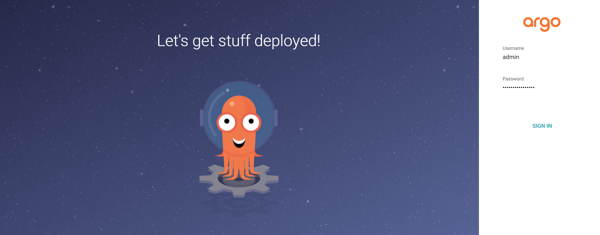

# ArgoCD installation
## install ArgoCD instance on Kubernetes
(based on this page: https://argo-cd.readthedocs.io/en/stable/getting_started/)

### Requirements
- Installed kubectl command-line tool.
- Connected to a Kubernetes cluster - Have a kubeconfig file (default location is ~/.kube/config).
 
### Install Argo CD using gitbash terminal:
```
kubectl create namespace argocd
kubectl apply -n argocd -f https://raw.githubusercontent.com/argoproj/argo-cd/stable/manifests/install.yaml
```
This will create a new namespace, argocd, where Argo CD services and application resources will live.

Change the argocd-server service type to LoadBalancer:
```
kubectl patch svc argocd-server -n argocd -p '{"spec": {"type": "LoadBalancer"}}'
```

Verify the changes following the command:
```
kubectl get svc -n argocd
```


Get the password from the new terminal using this command:
```
kubectl -n argocd get secret argocd-initial-admin-secret -o jsonpath='{.data.password}' | base64 -d
```

You can now access the Argo CD UI from your browser by typing the following URL:
```
localhost:443
```

Login to Argo CD UI using the username: 'admin' and and the above password



